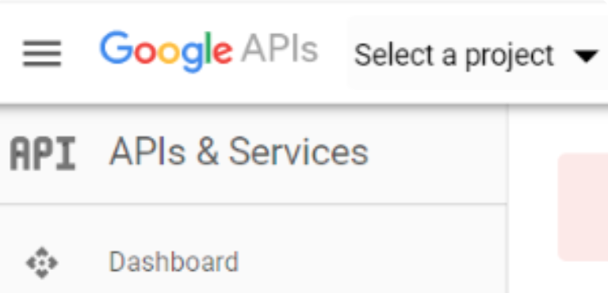
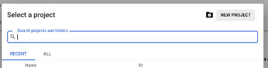
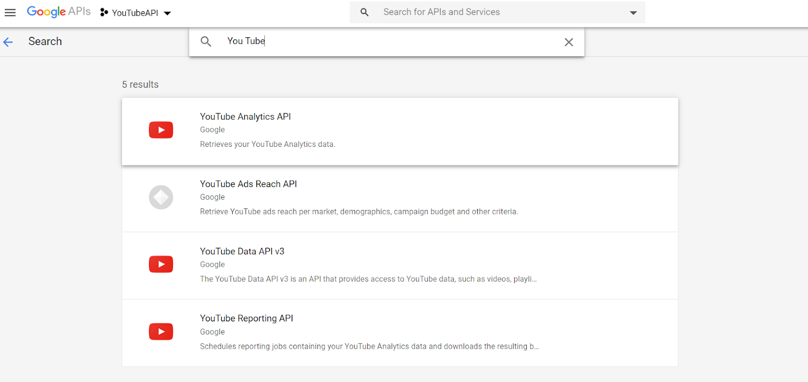
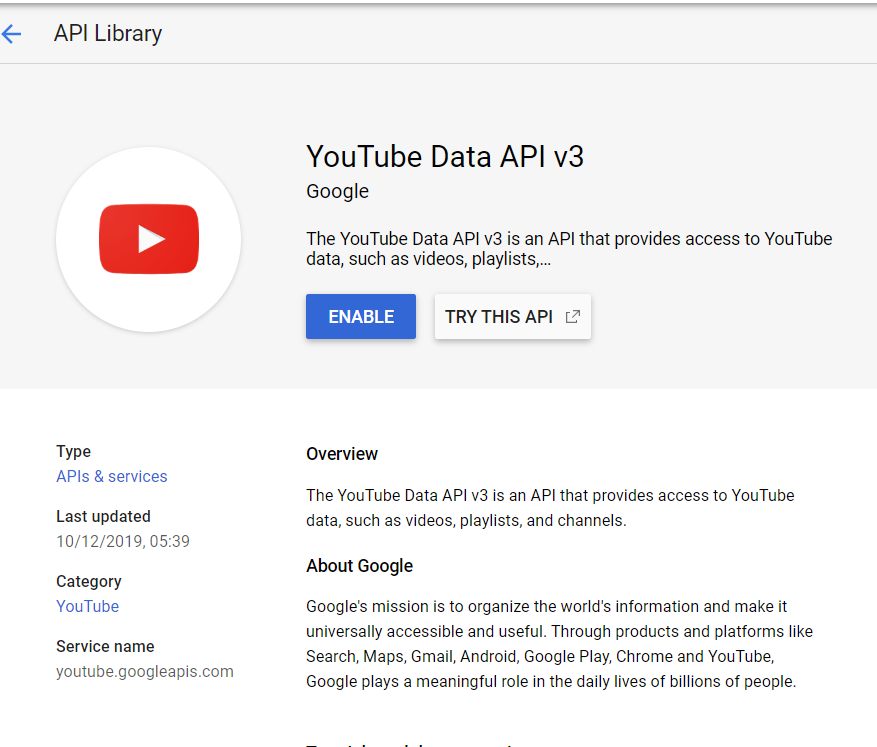
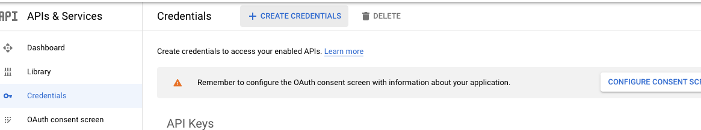
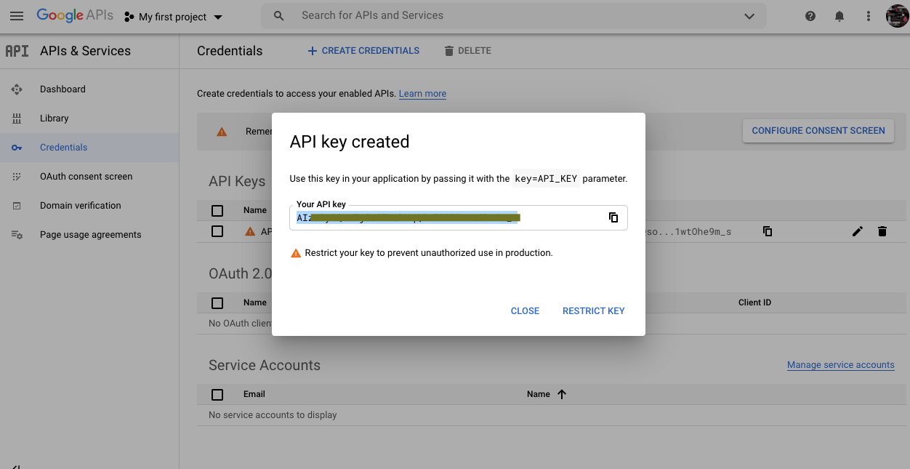

# Easy Extract and Analyse Youtube Data
1. Generate the API key:

Get your API key here: https://console.developers.google.com/

First login to Google, if you don't have an account create one and then login.

Visit the Google developer dashboard, create a new project from the top of the page as in below image, click “Select a project” from the top

 

Now Click on “New Project” as shown below.

 

Once done you will be automatically redirected to the Google APIs dashboard.
 
The next step is the activation of YouTube API, so for that navigate to the API & Services from the side panel.
Then click on Enable API & Services from the top of the page.
Search for YouTube and then select YouTube Data API v3.    

 

After that Enable the API by clicking on the Enable

 

Now again click on the API & Services and select credentials. Navigate to the Create Credentials from the top of the page in that select API key.

 

Once clicked after some time a pop up will come with the message API key created from there you will get our API key as alphanumeric. Copy that and keep it safe for further use.

 

2. Import the libraries:

pandas

google-api-python-client
 

